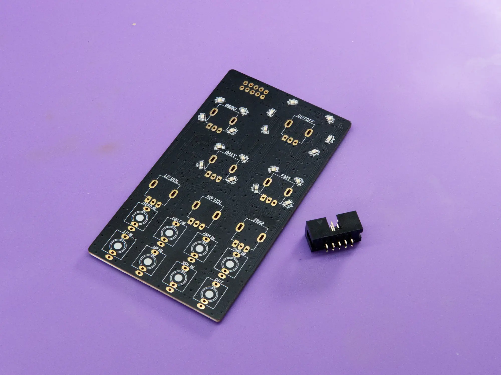
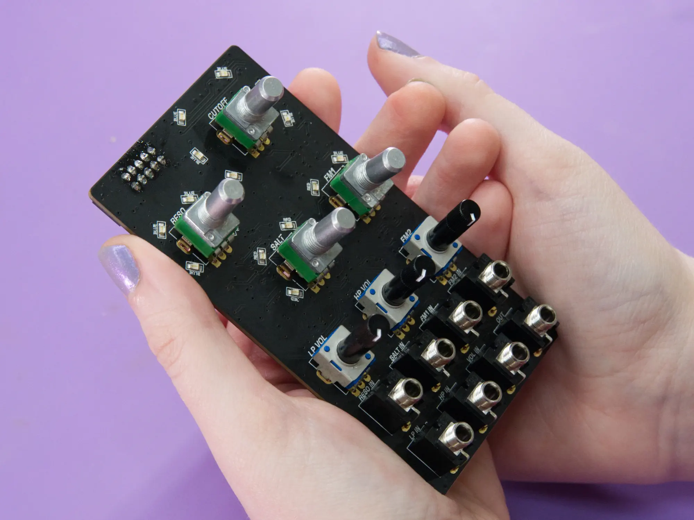
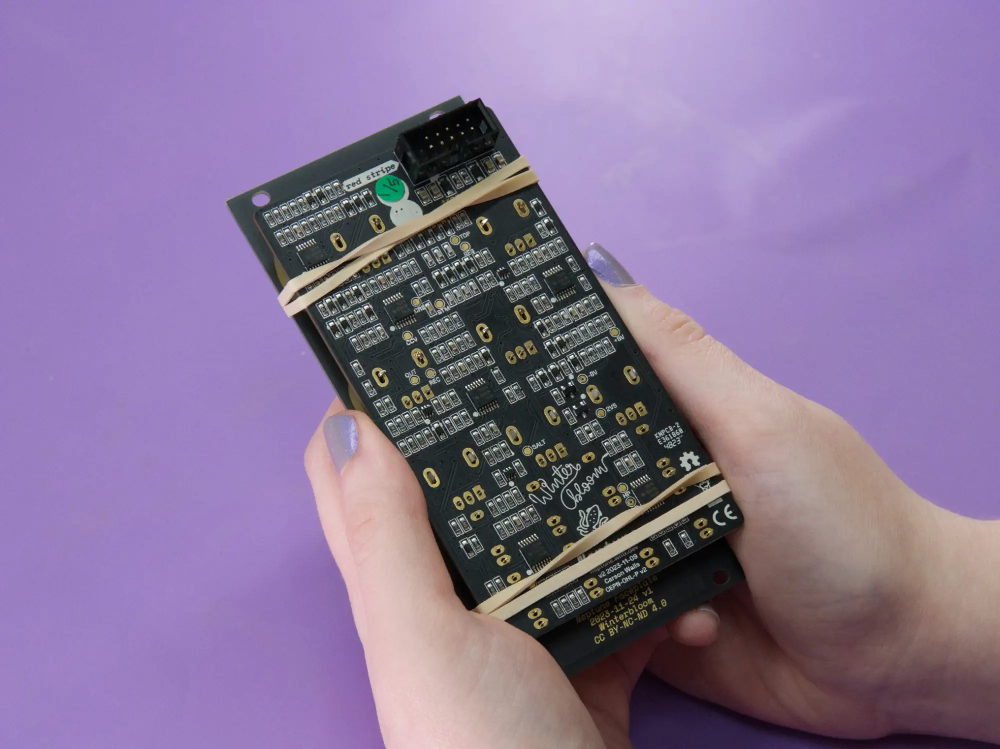
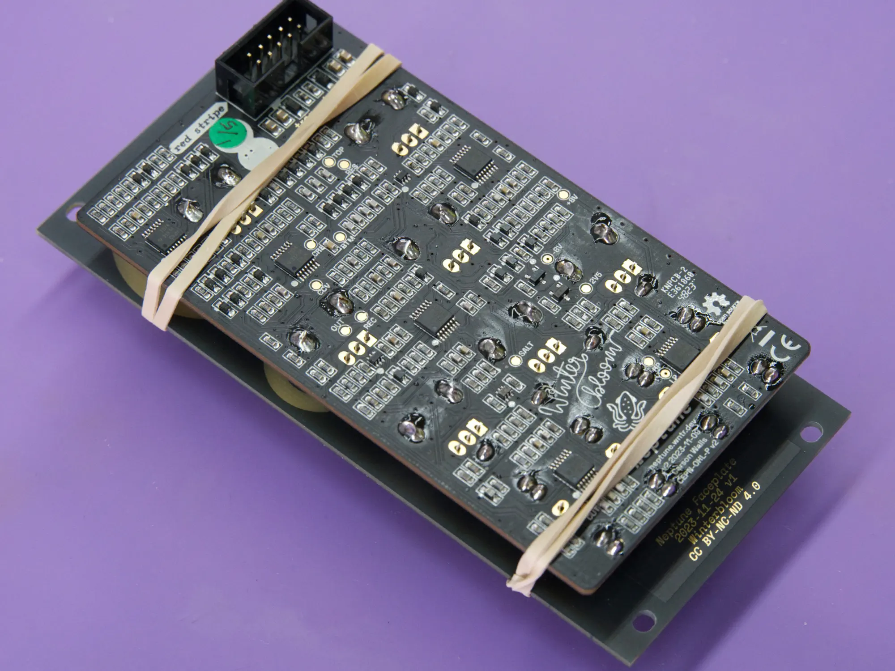
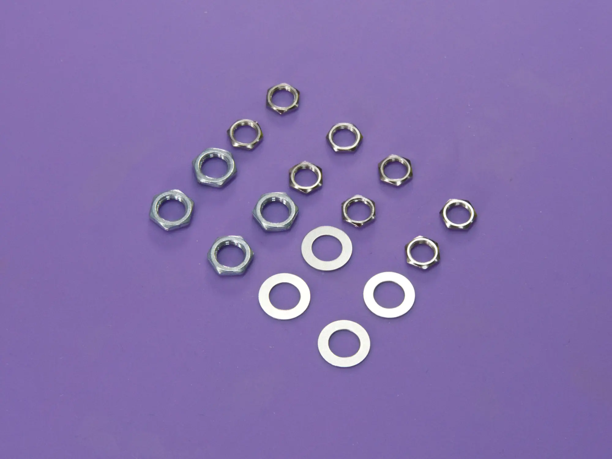
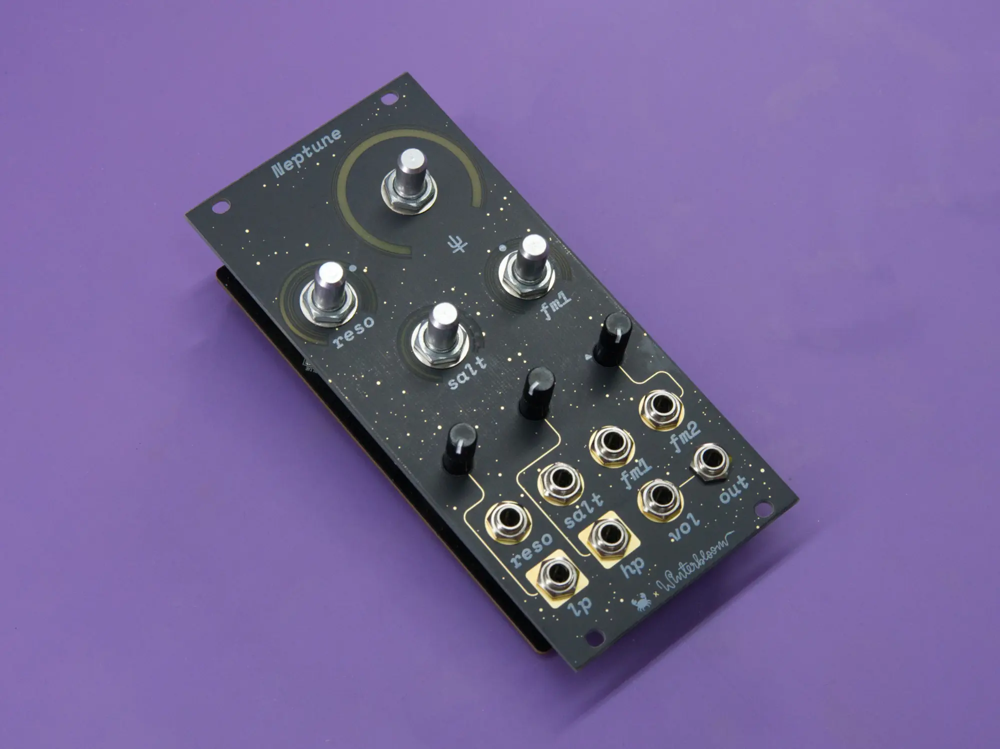
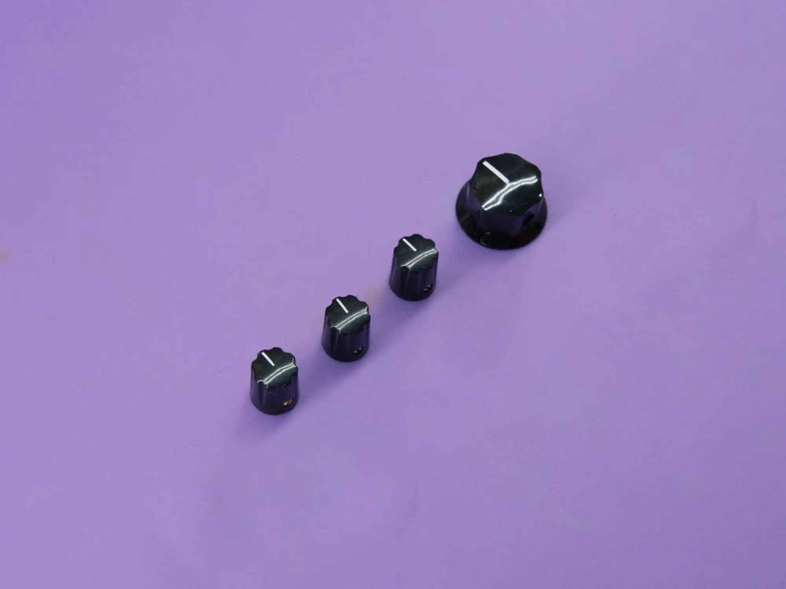

# Neptune kit build guide

[TOC]

## Before you build

Welcome to the build guide for Neptune's DIY kit. We hope you have a great time putting this module together and a wonderful time using it.

Please **read all instructions** thoroughly before starting. If you have questions or run into trouble please reach out to us on [discord] or drop us [an email][email].

This is a **beginner level** kit. Some soldering experience is helpful but not required, though do would recommend practicing on another project first. We also have some slightly easier kits available, such as our [Helium kit]. Even if you've got some experience, we recommend taking a look at [Adafruit's guide to excellent soldering][adafruit soldering guide].

This build takes around **one hour** to complete.

[discord]: https://discord.gg/UpfqghQ
[email]: mailto:support@winterbloom.com
[Helium kit]: https://winterbloom.com/shop/helium-kit
[adafruit soldering guide]: https://learn.adafruit.com/adafruit-guide-excellent-soldering

## Tools required

Before you begin, make sure that you've got:

-   Safety glasses. Yes, **really**. A pair like [these][safety glasses] are fine.
-   Proper ventilation, like this [small filtered fan](https://a.co/d/eUfPCRO).
-   A **temperature-controlled** soldering iron, like this [Hakko] or the [Pinecil]. It is very important to use a temperature-controlled iron, since unregulated irons can easily get hot enough to damage components. You should set your iron temperature based on your solder manufacturer's recommendations.
-   Solder. We recommend [Adafruit's SAC305 solder][adafruit solder] or [Kester 275 K100LD].
-   A small flat head screwdriver, like [this one][small screwdriver].

!!! fairy
    We suggest using solder with "no clean" flux. If you use a different kind of flux, be sure to carefully clean the flux residue off based on the guidelines provided by the manufacturer of your solder. Take special care with the LEDs and potentiometers, as they can be damaged by water and flux cleaners.

[safety glasses]: https://a.co/d/dMXvPP6
[tweezers]: https://www.adafruit.com/product/422
[Hakko]: https://www.adafruit.com/product/1204
[Pinecil]: https://pine64.com/product/pinecil-smart-mini-portable-soldering-iron/
[adafruit solder]: https://www.adafruit.com/product/734
[Kester 275 K100LD]: https://www.kester.com/products/product/275-flux-cored-wire
[flux pen]: https://www.sra-solder.com/sra-312-no-clean-flux-pen-refillable
[small screwdriver]: https://lovemyswitches.com/2mm-flat-head-screwdriver-for-knob-set-screws/

## Kit contents

Your kit should contain the following items. If any are missing please [email us][email].

<object
    alt="Kit contents"
    data-is-svg-map
    data-list="kit-contents-img-datalist"
    data-stylesheet="/styles/kit-contents-svgmap.css"
    data-info-text-template="kit-contents-img-info-text"
    data="../images/kit/kit-contents.svg"
    height="100%"
    id="kit-contents-img"
    type="image/svg+xml"
    width="100%">
</object>
<template id="kit-contents-img-info-text">
    <g id="info-text-container">
        <rect data-size-to="info-text"></rect>
        <text id="info-text"></text>
    </g>
</template>
<datalist id="kit-contents-img-datalist">
    <option value="mainboard">Mainboard</option>
    <option value="faceplate">Faceplate</option>
    <option value="jacks">1/8" jacks (8)</option>
    <option value="jack-nuts">Hex nuts for the 1/8" jacks (8)</option>
    <option value="power-header">Eurorack power header</option>
    <option value="rubber-bands">Rubber bands (2)</option>
    <option value="big-knob">Big knob</option>
    <option value="small-knob">Small knobs (3)</option>
    <option value="trimpots">Tall trimmer pots (3)</option>
    <option value="pots">9mm pots (4)</option>
    <option value="pot-washers">Washers for 9mm pots (4)</option>
    <option value="pot-nuts">Nuts for 9mm pots (4)</option>
</datalist>

<link rel="stylesheet" href="/styles/svgmap.css"/>

- (1) Mainboard
- (1) Faceplate
- (8) 1/8" jacks
- (8) Hex nuts for the 1/8" jacks
- (3) Tall trimmer pots
- (4) 9mm pots
- (4) Washers & nuts for the 9mm pots
- (3) Small knobs
- (1) Large knob
- (1) Eurorack power header
- (2) Rubber bands

!!! fairy "Pot washers?"
    We typically screw the 9mm pot's washer and nut onto the shaft when packing kits so they don't get lost. You should remove them before you start the build!

## Power header

Your first task is to solder the 10-pin Eurorack power connector to the mainboard.

The power connector goes on the **back** side of the board. When placing **note the notch in the outline on the board**. You'll need to make sure the **slot on the connector matches where the notch is on the outline**. The holes for the power connector are designed to be a tight fit, so make sure to push the header firmly flush against the board.

<figure data-layered>
  
  
  
  
</figure>

Once placed, make sure to push it flush against the board and then solder the 10 pins on the front side of the board.

<figure data-layered>
  
  
  
  
</figure>

!!! warning "Watch out for those LEDs!"
    Avoid touching the LEDs with your iron- they really don't like being melted and they're very hard to replace.

## Pots and jacks

Your next task is to put all of the jacks and pots into place. **Don't solder these yet**, as you'll use the faceplate to help you get everything aligned in the next step.

!!! fairy "Stuffing"
    Fun fact, we call this process "stuffing"! It makes us think of Thanksgiving. 🦃

Start with the four `9mm pots`. Place them onto upper area of mainboard in the spots labeled `cutoff`, `reso`, `salt`, and `fm1`. You may need to bend or straighten the mounting legs on the pots to get them in place.

<figure data-layered>
  
  
  
  
  
  
</figure>

Next up is the 3 `Tall trimmer pots`. Place these into the three spots in the middle of the mainboard labeled `lp vol`, `hp vol`, and `fm2`.

<figure data-layered>
  
  
  
  
  
</figure>

Finally, the `1/8" jacks`. These go on the lower area of the mainboard in the spots labeled `reso in`, `salt in`, `fm1 in`, `fm2 in`, `lp in`, `hp in`, `vol in`, and `out`.

<figure data-layered>
  
  
  
  
  
</figure>

At this point you should have all the jacks and pots in place:

## Faceplate alignment

Before you get down to soldering, your next task is to use the faceplate to make sure everything is aligned and hold it all in place while you work. Grab the `faceplate` and the two `rubber bands` and then carefully place the faceplate over the jacks and pots.

<figure data-layered>
  
  
  
  
</figure>

Take a moment to check that everything is aligned and flush, as it's much easier to fix now than later! Take the first `rubber band` and wrap it *twice* around the upper part of the module. Try to keep it in the same spot as the picture, since it'll make your life a little easier in the next step.

<figure data-layered>
  
  
</figure>

Now take the second `rubber band` and wrap it *twice* around the lower part of the module, once again, try to keep it in the same spot shown.

<figure data-layered>
  
  
</figure>

Now that everything is held in place, flip the module over. Double check that all the components are aligned, flush, and that the pins are sticking through all the gold pads.

## First soldering pass

Now's the time to break out the soldering iron! Your next task is to solder the pots and jacks in place. While you can do all of the soldering in one pass, we recommend following this two pass approach since it gives you one last chance to double check everything before it becomes **much** harder to fix.

!!! fairy "Hey, listen!"
    Be careful when soldering near Neptune's little surface mount components. Keep a close eye on your iron, as it's easy to accidentally angle it in a way that unintentionally hits one of the components.

Start by soldering just the **large, oval** pads for all of the pots:

<figure data-layered>
  
  
  
  
  
  
</figure>

Next, solder all the pins for the jacks that aren't obscured by the rubber band. You'll come back for the rest later.

<figure data-layered>
  
  
  
  
  
  
</figure>

Once done, your board should look like the image below:

**Take this last chance to double-check your work**. If any of the jacks or pots aren't flush or if any of their little pins managed to bend and miss their holes, fix that now. Once you've completely soldered everything it'll be **much** harder to fix!

## Second soldering pass

With everything in place, you can remove the rubber bands and finish up soldering. Start by taking off the rubber bands and removing the faceplate:

<figure data-layered>
  
  
</figure>

Now you can go through and solder all of the remaining legs on the pots and jacks:

<figure data-layered>
  
  
  
  
</figure>

Once done, your board should look like the following pictures:

<figure data-layered>
  
  
</figure>

## Hardware

Your next task is to place the washers and nuts on the pots and jacks.

!!! fairy "Dressing"
    Fun fact, we call this process "dressing"! It's like putting fancy clothes on your module. 🤵‍♀️

Start with the four `washers` for the 9mm pots, placing a single washer on each pot shaft:

<figure data-layered>
  
  
  
  
  
  
</figure>

Once the washers are in place, place the four larger `pot nuts` onto the pot shafts and hand tighten them.

<figure data-layered>
  
  
  
  
  
  
  
  
</figure>

Finally, place the eight smaller `jack nuts` onto each jack and hand tighten them:

<figure data-layered>
  
  
  
  
  
</figure>

Once done, your module should look like the image below.

## Knobs

Your final task is to add the four knobs to the 9mm pots.

Start by loosening the set screw on each of the knobs using a small flat head screwdriver.

<figure data-layered>
  
  
</figure>

Next, turn all of the 9mm pots fully counterclockwise. Place the `large knob` on the top right shaft with the indicator line at the **7 o' clock** position. Tighten the set screw to secure the knob in place.

<figure data-layered>
  
  
</figure>

Do the same for the remaining three `small knobs`.

<figure data-layered>
  
  
  
</figure>

## Finished

Congrats, you finished building your very own Neptune!

Don't forget to go check out the [User's Guide](/). We'd love to see your work, feel free to tag us on social media - we're `@wntrblm` on both [Twitter] and [Instagram].

If you have any feedback or ran into any issues, feel free to drop us an email at support@winterbloom.com or file a issue on [GitHub].

[Twitter]: https://twitter.com/wntrblm
[Instagram]: https://instagram.com/wntrblm
[GitHub]: https://github.com/wntrblm/Neptune

<link rel="stylesheet" href="../styles/layered.css" />

