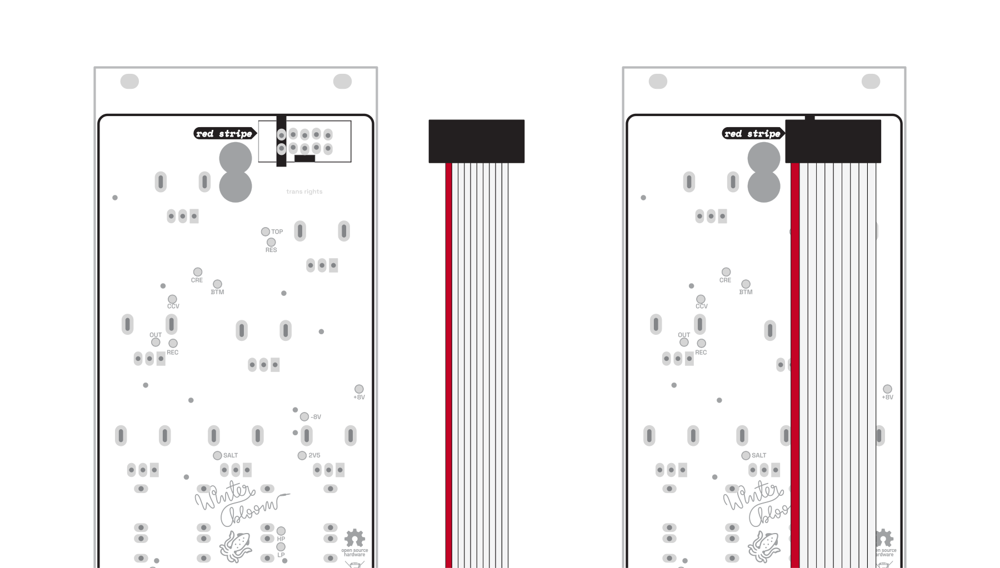
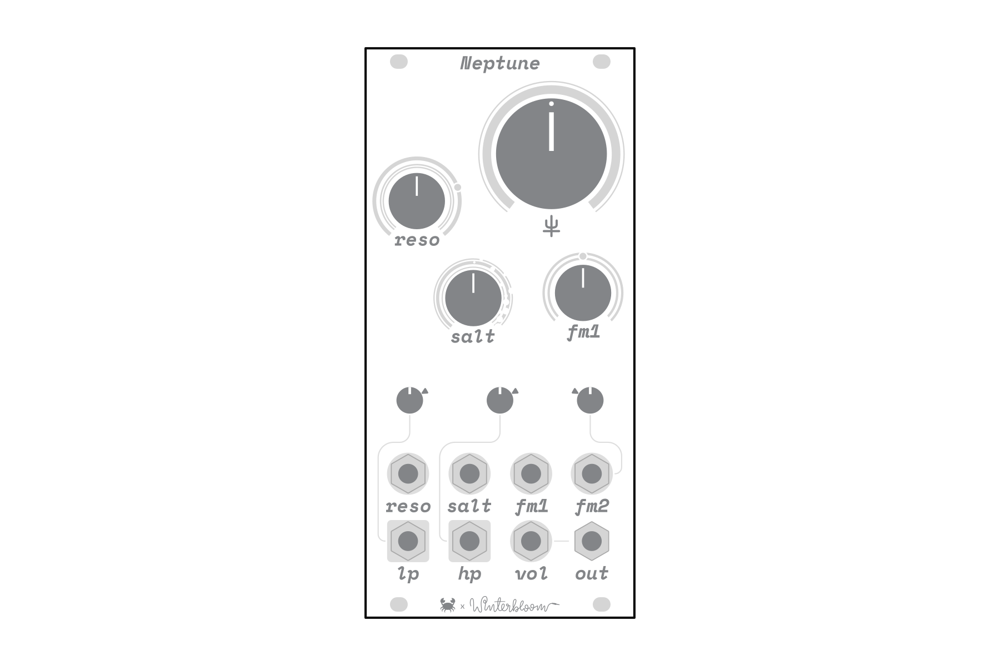
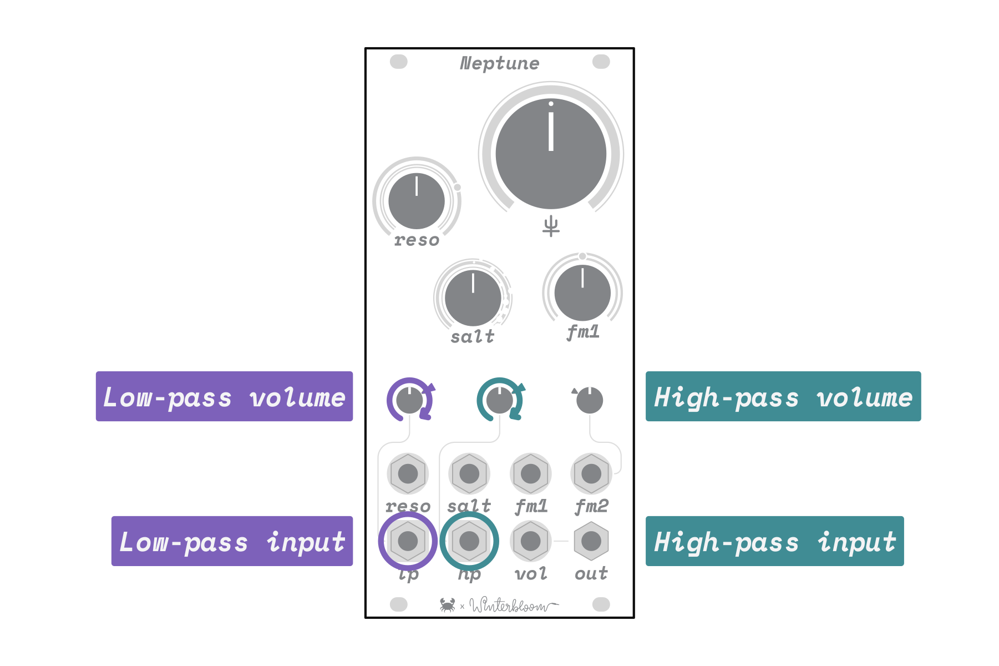
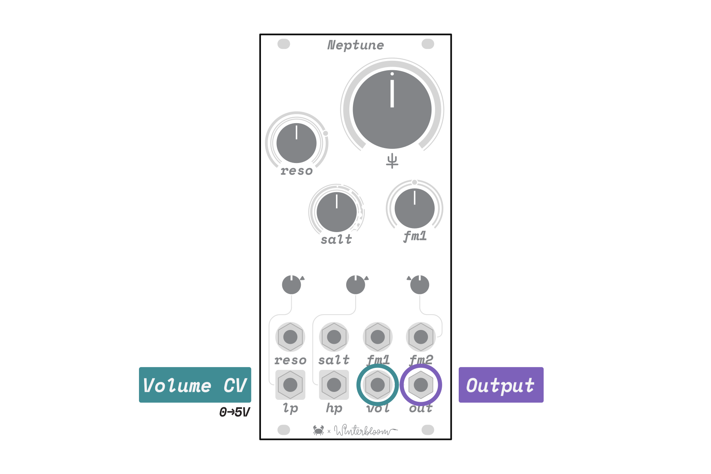
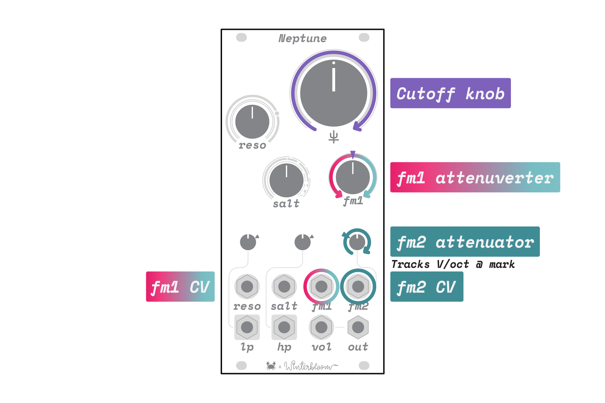
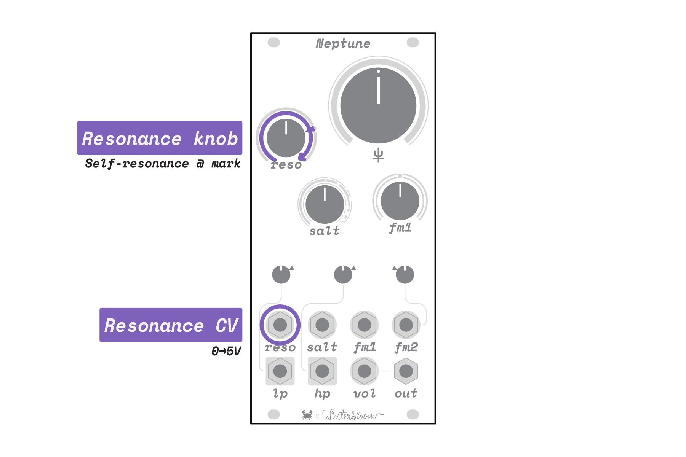
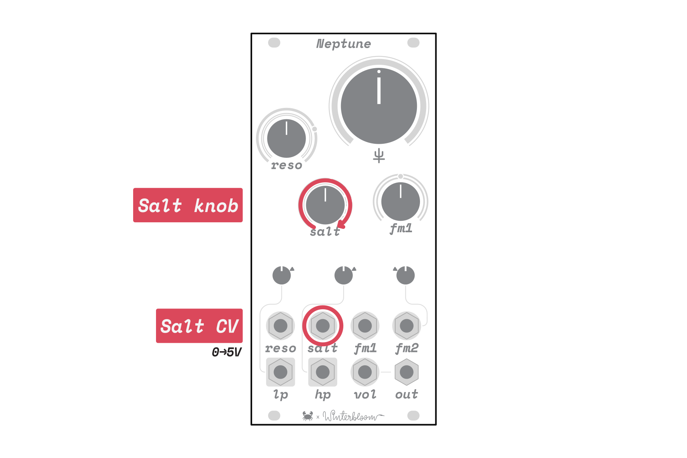
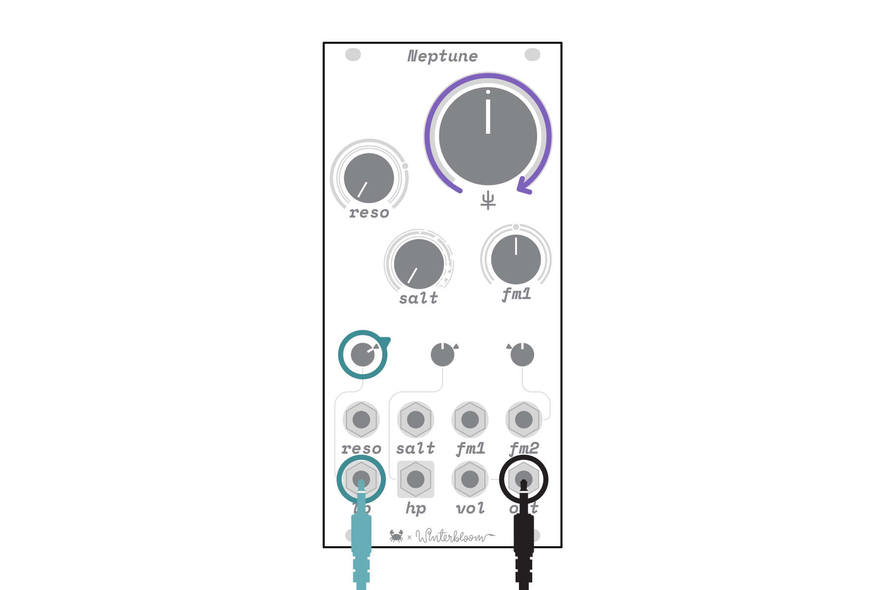
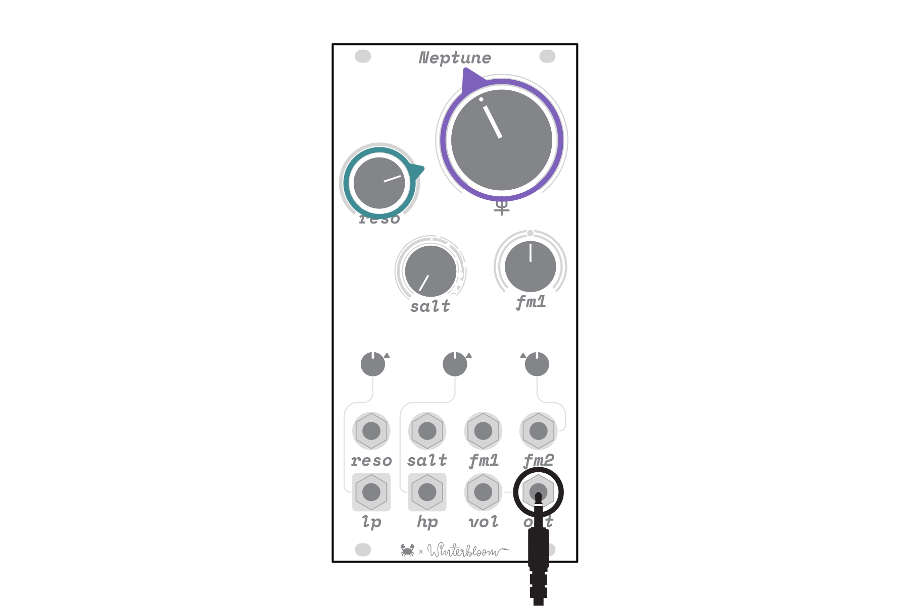

# Manual

Winterbloom's [Neptune][store-assembled] is a resonant diode ladder filter inspired by the designs of [Moritz Klein] and [Arturia]. It's intended to bring together sound and modulation into a complete, distinct synthesizer voice. Unlike typical multi-mode filters with separate modes or outputs, Neptune instead has separate low-pass and high-pass _inputs_ into a single filter core. This filter core is coupled with a feedback modulated distortion circuit called _salt_ that opens up a wide range of tonal possibilities from tame to dirty to outright chaotic.

[store-assembled]: https://winterbloom.com/shop/neptune
[store-kit]: https://winterbloom.com/shop/neptune-kit
[Moritz Klein]: https://www.youtube.com/@MoritzKlein0
[Arturia]: https://arturia.com

[TOC]

## Specifications

-   Available [assembled][store-assembled] or as a [kit][store-kit]
-   `12 HP`
-   `+12v @ 60 mA`, `-12v @ 50 mA`
-   `25mm` deep
-   Separate low pass & high pass inputs
-   Self-oscillating at high resonance levels
-   Salt feedback circuit
-   DC-coupled signal path
-   [ModularGrid page]

[modulargrid page]: https://www.modulargrid.net/e/winterbloom-neptune

## Getting support and help

We want you to have a wonderful experience with your module. If you need help or run into problems, please reach out to us. [Email] is the best way for product issues, whereas [Discord] and [GitHub][github issues] are great for getting advice and help on how to customize your module.

-   Send us [an email][email]
-   File a bug [on GitHub][github issues]
-   Reach out on the [Discord][discord]

[github issues]: https://github.com/wntrblm/Neptune/issues
[discord]: https://discord.gg/UpfqghQ
[email]: mailto:support@winterbloom.com

## Installation

To install this into your Eurorack setup, connect a Eurorack power cable from your power supply to the back of the module. **Note that even though there's a keyed power connector on the module, double check that the red stripe is on the side labeled `red stripe`!** Once you've connected the power cable, secure your module to your rack rails using screws.

## Overview

Like other filters, Neptune _subtracts_ frequencies from audio signals. Unlike most other filters, however, Neptune is a single filter with separate inputs for low-pass and high-pass. If you use just one of these inputs at a time, Neptune will act as a familiar low-pass or high-pass filter. However, using both inputs at the same time opens up new possibilities for combining and filtering multiple signals.

Neptune is also a _resonant_ filter, which allows you to boost the frequencies around the cutoff frequency. Neptune rounds out its sonic character with _Salt_- a feedback modulation circuit that can add subtle grit when used sparingly and wild, chaotic distortion when applied with abandon.

Neptune belongs to _diode ladder_ family of filters. These filters are known for their characteristic "dirty" sound compared to the modern, popular "smooth" OTA family. Diode filters behave quite differently from their counterparts, exhibiting increasingly non-linear behavior when overdriven or operated with high resonance. Neptune itself shares a lot of similarities with the _Steiner_ filters found in Arturia's Brute series, but the addition of the salt feedback circuit allows for a broader range of unpredictable sounds.

Neptune is a collaboration between [Carson Walls] and [Winterbloom]. Carson crafted Neptune's voice, layout, and electronics design, while Thea & Maggie took on Neptune's visuals, interface, physical design, and manufacturing.

*[OTA]: Operational transconductance amplifier
[Carson Walls]: https://decapoddevices.com
[Winterbloom]: https://winterbloom.com

## Interface

### Audio inputs

Neptune has separate audio inputs for low-pass and high-pass labeled with ++"lp"++ and ++"hp"++ respectively. Each input has its own volume control knob, where fully counterclockwise mutes the input. The mark at 2 o' clock indicates _unity gain_, where the input and output volume will be the same.

!!! fairy "Volume & resonance"
    Because of the architecture of this filter, the sound of the resonance is strongly affected by the input volume. The louder the input volume, the less obvious and "sweet" the resonance. If you want resonance to really catch the harmonics of the input, try reducing the input volume as you turn the resonance up.

### Audio output and volume

Neptune's audio output, ++"out"++, has a built-in VCA for volume control. The ++"vol"++ input responds to a `0 to 5 V` signal with `0 V` completely muting the output and `5 V` giving maximum volume. When ++"vol"++ is left unpatched, the output volume defaults to maximum.

*[VCA]: Voltage-controlled amplifier

### Cutoff frequency

Neptune dedicates several controls for the filter's _cutoff frequency_. Frequencies above the cutoff frequency are attenuated from the low-pass input signal, while frequencies below the cutoff are attenuated from the high-pass input signal.

The primary control for the cutoff frequency is the large cutoff knob labeled ++"♆"++. Turning the knob fully counterclockwise sets the cutoff frequency to near `0 Hz`, where the low-pass signal is almost entirely cut out while the high-pass signal is largely unaffected. Conversely, turning the knob fully clockwise sets the cutoff frequency to around `200 kHz`, where the low-pass signal is largely unaffected and the high-pass signal is cut out.

The cutoff frequency set by the ++"♆"++ knob can be _modulated_ by two similar but distinct CV inputs labeled ++"fm1"++ and ++"fm2"++. Both inputs respond to `±5 V` signals but ++"fm1"++ has an _attenuverter_ while ++"fm2"++ has an _attenuator_.

The ++"fm1"++ _attenuverter_ controls both the _level_ and _polarity_ of ++"fm1"++'s CV input signal. At 12 o' clock, no signal is passed through. Turning clockwise gradually introduces the signal while turning counterclockwise gradually introduces an inverted version of the signal. The ring of LEDs around ++"fm1"++ indicate the polarity and level of modulation: blue indicates a positive signal, while red indicates a negative signal.

Similarly, the smaller ++"fm2"++ _attenuator_ controls just the _level_ of ++"fm2"++'s CV input signal. Fully counterclockwise completely attenuates the signal, while turning clockwise gradually introduces the signal. The white marking indicates where the cutoff frequency will roughly track at `1 Volt / octave`, but note that due to the way the filter works this will not track perfectly.

Finally, the LEDs around the ++"♆"++ knob indicate the total combined effect of ++"♆"++ along with the ++"fm1"++ & ++"fm2"++ inputs and controls. LEDs to the left of the knob indicate that more of the low-pass signal is being passed, while the LEDs to the right indicate that more of the high-pass signal is being passed.

!!! fairy "CV Range"
    Neptune's control voltages are nominally `±5 V`, but it's generally fine with voltages beyond this range. Just note that it may not respond as expected when you get far out of that range.

*[CV]: Control Voltage

### Resonance

Neptune is a _resonant_ filter, and like other filters, resonance increases the volume of frequencies near the cutoff frequency. Neptune's resonance is controlled with the ++"reso"++ knob and CV input. The ++"reso"++ knob introduces more and more resonance as you turn the knob clockwise. When the ++"reso"++ knob is turned beyond the white dot the filter will begin self-oscillating, indicated with a red LED. Likewise, the ++"reso"++ CV input responds to `0 to 5 V` and is summed with the ++"reso"++ knob.

Unlike many filters, Neptune does not cut out bass frequencies as the resonance is turned up. While this preserves low-end frequencies, it can lead to the input volume overwhelming the resonance. If you want a "sweeter" resonance sound, try reducing the input volume when the resonance is turned up.

### Salt

Neptune includes a feedback modulation circuit called _Salt_. When used sparingly, salt can add a bit of subtle grit and sonic character to your sound. When used with gleeful abandon, salt will create increasingly chaotic distortion with harsh overtones.

Salt is controlled by the ++"salt"++ knob and CV input. The ++"salt"++ knob introduces more and more feedback modulation as you turn the knob clockwise. Keep in mind that salt and resonance are inherently linked and interact strongly, meaning that more resonance will increase salt's effect and vice versa. There are many textures to be found in different combinations of salt, resonance, and input volume.

## Example patches

If you're not sure where to start with Neptune this section has a few patches to get you up and running. Grab your patch cables, an oscillator, and an output module to follow along.

### Low-pass filter

The first patch creates a familiar *low-pass filter*:

-   Turn the ++"reso"++ and ++"salt"++ knobs all the way counterclockwise
-   Turn the ++"♆"++ knob to 12 o' clock
-   Turn the small ++"lp"++ volume knob to about 2 o' clock
-   Patch an oscillator into the ++"lp"++ input jack
-   Patch the output jack to your rack's output or headphones module

Once patched, use the ++"♆"++ knob to sweep through the filter's frequency range. Try introducing some resonance using the ++"reso"++ knob and salt using the ++"salt"++ knob.

<winter-audio-player title="Low-pass filter sweep">
        <source src="./media/lp-sweep.flac" type="audio/flac" />
        <source src="./media/lp-sweep.m4a" type="audio/x-m4a" />
</winter-audio-player>
<winter-audio-player title="Resonant low-pass filter sweep">
    <source src="./media/resonant-lp-sweep.flac" type="audio/flac" />
    <source src="./media/resonant-lp-sweep.m4a" type="audio/x-m4a" />
</winter-audio-player>
<winter-audio-player title="Resonant, salty low-pass filter sweep">
    <source src="./media/resonant-salty-lp-sweep.flac" type="audio/flac" />
    <source src="./media/resonant-salty-lp-sweep.m4a" type="audio/x-m4a" />
</winter-audio-player>

### High-pass filter

The second patch is similar to the first and creates a *high-pass filter*:

-   Turn the ++"reso"++ and ++"salt"++ knobs all the way counterclockwise
-   Turn the ++"♆"++ knob to 12 o' clock
-   Turn the small ++"hp"++ volume knob to about 2 o' clock
-   Patch an oscillator into the ++"hp"++ input jack
-   Patch the output jack to your rack's output or headphones module

Once patched, use the ++"♆"++ knob to sweep through the filter's frequency range. Once again, try introducing some resonance using the ++"reso"++ knob and salt using the ++"salt"++ knob.

<winter-audio-player title="High-pass filter sweep">
    <source src="./media/hp-sweep.flac" type="audio/flac" />
    <source src="./media/hp-sweep.m4a" type="audio/x-m4a" />
</winter-audio-player>
<winter-audio-player title="Resonant high-pass filter sweep">
    <source src="./media/resonant-hp-sweep.flac" type="audio/flac" />
    <source src="./media/resonant-hp-sweep.m4a" type="audio/x-m4a" />
</winter-audio-player>
<winter-audio-player title="Resonant, salty high-pass filter sweep">
    <source src="./media/resonant-salty-hp-sweep.flac" type="audio/flac" />
    <source src="./media/resonant-salty-hp-sweep.m4a" type="audio/x-m4a" />
</winter-audio-player>

### High/low shelf filter

The next patch uses both inputs to create a high/low shelf filter:

-   Turn the ++"reso"++ and ++"salt"++ knobs all the way counterclockwise
-   Turn the ++"♆"++ knob to 12 o' clock
-   Turn the small ++"lp"++ and ++"hp"++ volume knobs to about 12 o' clock
-   Using a multiple or stackcable, patch the *same* oscillator signal into both ++"lp"++ and ++"hp"++ input jacks
-   Patch the output jack to your rack's output or headphones module

Once patched, you can use the ++"lp"++ and ++"hp"++ volume knobs as your low- and high-pass shelves while the ++"Neptune ♆"++ knob controls the shelving frequency. You can use resonance as a frequency boost to *emphasize* the frequencies around the shelving frequency without cutting out the rest.

<winter-audio-player title="High/low shelf filter">
    <source src="./media/low-shelf-example.flac" type="audio/flac" />
    <source src="./media/low-shelf-example.m4a" type="audio/x-m4a" />
</winter-audio-player>

### Spectral crossfader

The next patch uses different signals on both inputs to create a *spectral* crossfader:

-   Turn the ++"reso"++ and ++"salt"++ knobs all the way counterclockwise
-   Turn the ++"♆"++ knob to 12 o' clock
-   Turn the small ++"lp"++ and ++"hp"++ volume knobs to about 2 o' clock
-   Patch two different signals into the ++"lp"++ and ++"hp"++ input jacks
-   Patch the output jack to your rack's output or headphones module

Once patched, you can use the ++"♆"++ knob to crossfade between the frequency contents of the two signals, picking out the low frequencies of one signal and the high frequencies of the other.

<winter-audio-player title="High/low-pass crossfade">
    <source src="./media/lp-hp-crossfade.flac" type="audio/flac" />
    <source src="./media/lp-hp-crossfade.m4a" type="audio/x-m4a" />
</winter-audio-player>

### Self-oscillation

The final patch explores *self-oscillation*:

-   Leave the ++"lp"++ and ++"hp"++ input jacks unpatched
-   Turn the ++"salt"++ all the way counterclockwise
-   Turn the ++"♆"++ knob to around 10 or 11 o' clock
-   Turn the ++"reso"++ knob up to the self-oscillation point marked with the white dot, just past 2 o' clock
-   Patch the output jack to your rack's output or headphones module

Once patched, the filter should be self-oscillating and generating a sine waveform. You can use the ++"♆"++ knob to set the output signal's frequency. If you further increase resonance past the white dot, the waveform will saturate and become more harsh, like a square wave. Adding salt will cause the waveform to become more unstable and chaotic.

<winter-audio-player title="Clean self-oscillation">
    <source src="./media/clean-self-oscillation-sweep.flac" type="audio/flac" />
    <source src="./media/clean-self-oscillation-sweep.m4a" type="audio/x-m4a" />
</winter-audio-player>
<winter-audio-player title="Full self-oscillation">
    <source src="./media/full-self-oscillation-sweep.flac" type="audio/flac" />
    <source src="./media/full-self-oscillation-sweep.m4a" type="audio/x-m4a" />
</audio>
<winter-audio-player title="Salty self-oscillation">
    <source src="./media/salty-self-oscillation-sweep.flac" type="audio/flac" />
    <source src="./media/salty-self-oscillation-sweep.m4a" type="audio/x-m4a" />
</winter-audio-player>

## Further explorations

These ideas go beyond the example patches and may help you explore Neptune's uses and sonic possibilities.

### Basic synth voice

<winter-audio-player title="Basic low-pass synth voice">
    <source src="./media/simple-low-pass-filter-synth-voice-loop.flac" type="audio/flac" />
    <source src="./media/simple-low-pass-filter-synth-voice-loop.m4a" type="audio/x-m4a" />
</winter-audio-player>

Use any oscillator as the input for the ++"lp"++ in, preferably with a sharp waveform like a saw or square. Use an envelope going the ++"fm1"++ and ++"vol"++ inputs. Trigger the envelope with a gate source from a keyboard or sequencer. Adjust the envelope timings to get long drones notes, or quick percussive ones. Adjust the cutoff frequency, ++"fm1"++ amount, resonance, and salt to hear the range of possible sounds from the low-pass filter.

### Spectral crossfading synth voice

<winter-audio-player title="Spectral crossfading synth voice" loop>
    <source src="./media/crossfading-synth-voice-loop.flac" type="audio/flac" />
    <source src="./media/crossfading-synth-voice-loop.m4a" type="audio/x-m4a" />
</winter-audio-player>

Patch one oscillator to the ++"lp"++ input and another oscillator to the ++"hp"++ input, or use different waveforms from the same oscillator. Make sure the oscillators are tuned close to each other for the most harmonious sound. Listen to how the filter can fade between the frequencies of the two oscillator signals. Plug one envelope to ++"fm1"++ and a different envelope to ++"vol"++. Trigger the envelopes with the same gate source, such as a keyboard or sequencer. Try different envelope shapes to get different responses, and listen to how different input signals and volumes effect the sound. Try different oscillator tunings, at octaves or ratios for nice harmonic sounds, or detuned for more dissonant ones.

### Kick drum voice

<winter-audio-player title="Kick drum voice">
    <source src="./media/kick-drum-voice.flac" type="audio/flac" />
    <source src="./media/kick-drum-voice.m4a" type="audio/x-m4a" />
</winter-audio-player>

Leave the ++"lp"++ and ++"hp"++ inputs unpatched. Turn ++"reso"++ up until the filter starts self oscillating. Send a fast, exponential envelope to ++"fm1"++ input and a second slower envelope to ++"vol"++. The fast exponential envelope is the kick drum’s pitch sweep, whose intensity is adjusted with the ++"fm1"++ attenuverter. Adjust the cutoff frequency to set the base pitch of the drum sound, for example set it to around 9 o’clock for a low bass drum sound. Try increasing the resonance or adding salt to increase the grittiness of the drum.

### Chaotic oscillator

<winter-audio-player title="Chaotic oscillator">
    <source src="./media/chaotic-oscillation.flac" type="audio/flac" />
    <source src="./media/chaotic-oscillation.m4a" type="audio/x-m4a" />
</winter-audio-player>

Leave the ++"lp"++ and ++"hp"++ inputs unpatched and turn ++"reso"++ up until the filter starts self oscillating. Turn ++"salt"++ up until it *just* starts to get chaotic. The filter cutoff frequency will twist and wobble around, making a chaotic output which is a combination of feedback effects. Try adjusting the cutoff frequency, resonance, and salt to get a whole spectrum of sounds, from stable and harmonious, to wild and unstable.

### Drum effects

<winter-audio-player title="Drum effects">
    <source src="./media/drum-effects.flac" type="audio/flac" />
    <source src="./media/drum-effects.m4a" type="audio/x-m4a" />
</winter-audio-player>

Send a drum mix, such as a recording or a mix of synthesized drums, to both the ++"lp"++ and ++"hp"++ inputs. This will make the filter act like [a shelf filter](#highlow-shelf-filter). The ++"lp"++ and ++"hp"++ volume knobs act as the level for the low shelf and the high shelf, while the cutoff frequency controls the crossover point of the shelves. Try adding a bit of resonance, lowering the high pass volume a bit to make a low shelf filter, and adjusting the cutoff frequency to target specific frequencies in the drum mix. For example try to emphasizing the snare or getting rid of some of the high frequencies without cutting them out completely like on a traditional low pass filter.

### Loop crossfader

Use a device like an [Octatrack], [Digitakt], or any sampler that can output two different loops matched to the same tempo. If you only have a stereo output, you can hard-pan the loops to left and right channel before patching. Send one loop to the ++"lp"++ input and the other loop to the ++"hp"++ input. Adjusting the cutoff frequency will allow you to fade between the frequencies of the two loops. If the cutoff knob is fully clockwise you'll only hear the loop in the ++"lp"++ input, while if it's counterclockwise you'll only hear the loop in the ++"hp"++ input. You can adjust it to pick out the high frequencies of one loop, such as the cymbals, and the low frequencies of another loop, such as the bass drum.

[Octatrack]: https://www.elektron.se/us/octratrack-mkii-explorer
[Digitakt]: https://www.elektron.se/us/digitakt-explorer

### CV filter

Neptune is *technically* DC-coupled, so will pass and filter CV signals just as it does audio signals. If you send a signal to the ++"lp"++ input then Neptune will act like a *slew limiter*, limiting how fast the signal can move. If you use the ++"hp"++ input then Neptune will act like a gate to trigger converter, where sudden changes will be passed through but the output will settle back to the value at the ++"lp"++ input. Increasing resonance will cause Neptune to overshoot the input value and "ring".

Note that while Neptune can do some fun stuff with CV, it's very much designed with audio in mind which brings some limitations. First, the lowest cutoff frequency that the ++"♆"++ knob can reach is around `5 Hz`, however, you can use the ++"fm1"++ input along with its attenuverter to push the cutoff frequency even lower. Second, Neptune wasn't really designed for DC accuracy so it won't work well with sensitive CV signals like `1 V / Octave` pitch signals. Finally, Neptune's output can have a DC offset of up to `±2 V`, however, you can mitigate this a bit by mixing a constant voltage in with the ++"lp"++ input.

## Open source hardware & software

Neptune is completely open source and hacking is encouraged.

The [hardware design][hardware source] is available under the permissive [CERN-OHL-P v2] license, and is designed using [KiCAD], which is also free and open source. You can open the hardware files using [KiCAD], or you can download a PDF of the [schematics].

{: .inline .small } Neptune is [certified open source hardware][oshwa certification].

[hardware source]: https://github.com/wntrblm/Neptune/tree/main/hardware
[schematics]: https://github.com/wntrblm/Neptune/raw/main/hardware/board/mainboard.pdf
[CERN-OHL-P v2]: https://cern-ohl.web.cern.ch/
[KiCAD]: https://kicad.org/
[oshwa certification]: https://certification.oshwa.org/us002605.html

## Warranty, disclaimers, and limits

Modules purchased from Winterbloom have a warranty of six months from the date of purchase. This warranty covers any manufacturing defects in the module. It does not cover damage due to incorrect handling, storage, power, overvoltage events, or modifications.

Please [contact us][email] if you are experiencing issues with your module. Modules returned under warranty will either be refunded, replaced, or repaired at our discretion. You will be responsible for the cost of returning the module to Winterbloom.

Because Eurorack has a vast number of possible combinations of power supplies, modules, cases, and accessories, it is impossible for us to guarantee compatibility with every possible configuration. We make a reasonable effort to test modules with several power supplies, cases, and other modules.

We encourage tinkering, however, we will not refund, repair, or replace any products that have been modified.

We have stress tested Neptune under the following conditions. These are provided for reference only; we do not guarantee that the module will function under these conditions.

-   Continuous run time: at least `48 hours`
-   Overvoltage from power supply: at least `±20 V`
-   Reverse voltage from power supply: at least `±24 V`
-   Undervoltage from power supply: as low as `±8 V`
-   Over and under voltage on inputs: at least `±11 V`
-   Output shorted to ground: at least `60 minutes`

[email]: mailto:support@winterbloom.com

## Acknowledgments and thanks

Neptune would not be possible without the excellent educational YouTube videos by [Moritz Klein], and the help of him and others on his discord server. We would also like to acknowledge the following individuals for their outstanding support:

- Sarah Ocean, for coming up with the name "Salt"
- Izaak Hollander, for endless enthusiasm and beta testing
- Ben Wilson, for being a well of knowledge and incredible talent
- Jeremy Leaird-Koch, for wringing delights from Neptune in ways only he could
- Stijn & Priscilla Haring-Kuipers, for their guidance and insight
